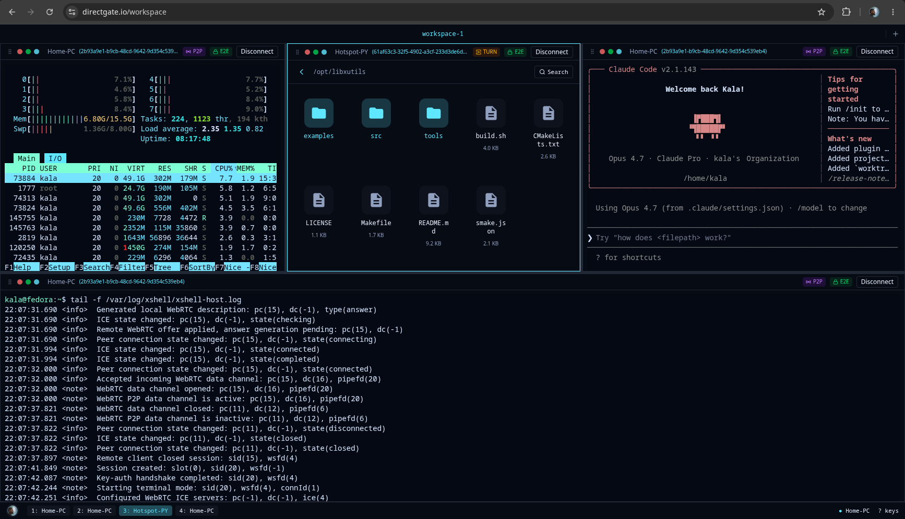
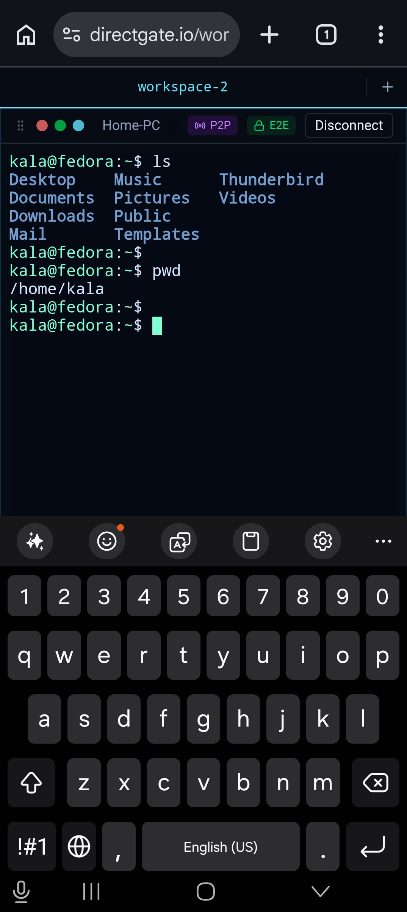
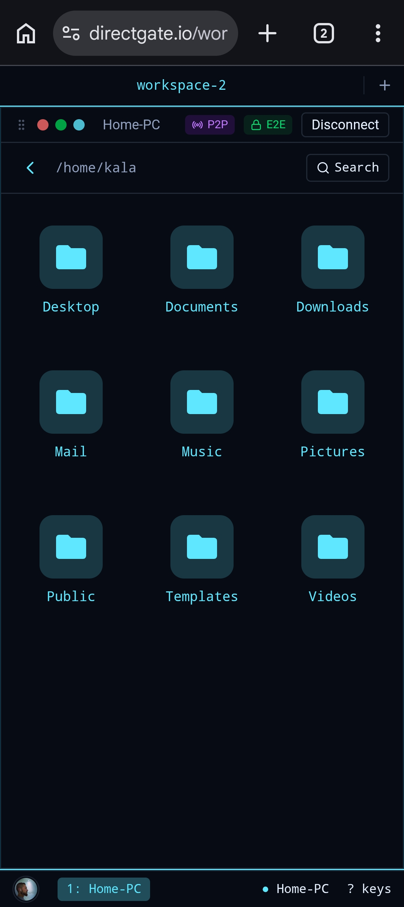
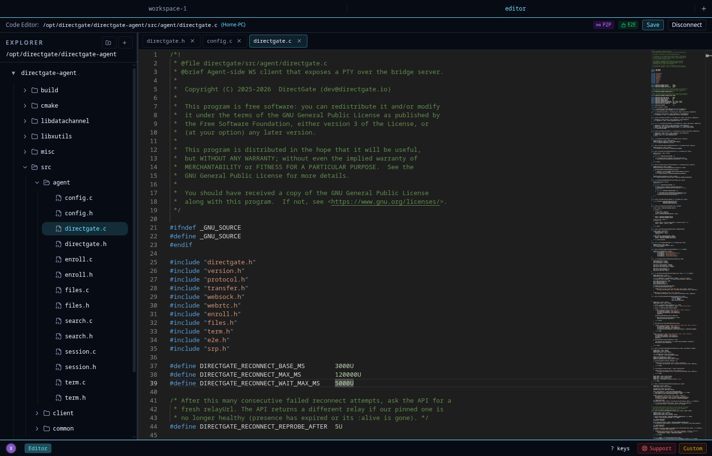

[](https://github.com/directgate/directgate-agent/blob/main/LICENSE)
[](https://github.com/directgate/directgate-agent/actions/workflows/linux.yml)
[](https://github.com/directgate/directgate-agent/actions/workflows/macos.yml)
[](https://github.com/directgate/directgate-agent/actions/workflows/tests.yml)
[](https://github.com/directgate/directgate-agent/actions/workflows/sanitizers.yml)
[](https://github.com/directgate/directgate-agent/actions/workflows/codeql.yml)

<div align="center">

## Your devices. Accessible everywhere. Exposed nowhere.

</div>

Reach your computers, servers, terminal, files, and code editor from any browser - through secure direct connections. Nothing listens on the public internet. No VPN to run. No port to forward.

- Works behind NAT
- No port forwarding
- No firewall changes
- No static IP needed
- End-to-End encrypted
- Peer-to-peer whenever possible

# DirectGate (Agent)

This repository contains the **DirectGate agent** - the open-source program you install on a machine you want to reach remotely. It is the client-side component of [**directgate.io**](https://directgate.io): you run the agent on your own computer or server, pair it with your account, and then open a fully featured terminal, file manager and code editor against it from any browser.

The agent is the only part of DirectGate that runs on *your* hardware and touches *your* shell, so it is open-sourced for transparency. You can read every line, audit the cryptography, and build it yourself to confirm that the binary you run is exactly this code.

The agent exposes an interactive PTY over a connection that is **end-to-end encrypted** and, whenever possible, **peer-to-peer (WebRTC)** - so terminal I/O and file transfers flow directly between your browser and your machine, and the relay operated by directgate.io never sees plaintext.

## Quick Start

1. [Install the DirectGate agent for your operating system](#installation).
2. Sign in at [directgate.io](https://directgate.io), add a new device, and run the ready-to-use pairing command shown in the web client:

   ```bash
   directgate -sed <device_id> -t <pairing_token>
   ```

3. Restart the agent service as described in [Pairing With Your Account](#pairing-with-your-account), then connect to the device from the web client.

## Why is the agent open source?

DirectGate is built around a simple principle: software that runs on your machines should be auditable.

While the DirectGate cloud infrastructure (API, relay, account management, and web services) is operated by directgate.io, the agent that runs on your computers and servers is fully open source.

You can:

- Audit the source code
- Build the agent from source
- Compare releases against published source packages
- Verify debug symbols
- Independently reproduce binaries

Source and debug packages are published for every release to provide transparency and independent verification of distributed binaries.

## The directgate.io web client

Using the hosted DirectGate web client requires trust in the DirectGate service and API infrastructure, just as with any other SaaS platform. While the agent source code is public and can be independently audited, account management, signaling, and service coordination are provided by DirectGate.

Everything below runs against the agent in this repository. These are the experiences the agent powers once it is paired with your account:

<table align="center">
  <tr>
    <td align="center">
      
      <br /><sub>Fully customizable window manager with multiple sessions in one workspaces tab. Terminals, file managers and/or code editors - each showing its own transport mode (P2P, TURN, or relayed) and end-to-end encryption status.</sub>
    </td>
  </tr>
</table>

<table align="center">
  <tr>
    <td align="center" valign="top" width="50%">
      
      <br /><sub><b>Mobile terminal</b> - a full PTY session in the phone browser, with <b>P2P</b> and <b>E2E</b> badges.</sub>
    </td>
    <td align="center" valign="top" width="50%">
      
      <br /><sub><b>Mobile file manager</b> - browse and manage remote files from your phone.</sub>
    </td>
  </tr>
</table>

<table align="center">
  <tr>
    <td align="center">
      
      <br /><sub><b>Code editor</b> - edit files on the remote machine directly from the browser.</sub>
    </td>
  </tr>
</table>

## Table of Contents

- [Quick Start](#quick-start)
- [How It Fits Together](#how-it-fits-together)
- [Architecture](#architecture)
- [Security Model](#security-model)
- [WebRTC P2P](#webrtc-p2p)
- [File Transfer & Remote File Manager](#file-transfer--remote-file-manager)
- [Protocol Specification](#protocol-specification)
- [Installation](#installation)
- [Pairing With Your Account](#pairing-with-your-account)
- [Configuration](#configuration)
- [Running the Agent](#running-the-agent)
- [Building From Source](#building-from-source)
- [Repository Layout](#repository-layout)
- [Security Considerations](#security-considerations)
- [License](#license)

## How It Fits Together

DirectGate has three pieces. Only the first one lives in this repository:

- **Agent** (`directgate`, this repo) - runs on your machine. It performs authentication, spawns a PTY with an interactive shell, encrypts whole traffic end-to-end, serves the remote file manager, and establishes a direct WebRTC data channel to the client.
- **Relay / signaling** - operated by directgate.io. It pairs agents and clients by identifier, relays the authentication and WebRTC signaling traffic, and forwards encrypted payloads when a direct P2P link is not possible. It is never able to read terminal, file manager or code editor data. It is **not** part of this repository.
- **Client** - the web client at directgate.io (recommended), or the experimental `dgcli` CLI in this repo. The client authenticates with the agent and renders the terminal, file manager and editor.

After authentication, the client and agent automatically negotiate a WebRTC peer-to-peer data channel. Once it is open, all terminal I/O and file transfers flow **directly between the two peers**, bypassing the relay entirely.

## Architecture

**WebSocket relay (used for signaling and as fallback):**

```
+--------------+              +-----------------+              +--------------+
|   DG agent   | <-- WSS -->  |  directgate.io  |  <-- WSS --> |    Client    |
|    (PTY)     |              | (relay/signal)  |              | (web / CLI)  |
+--------------+              +-----------------+              +--------------+
       ^                                                              ^
       |                      End-to-End Encryption                   |
       +--------------------------------------------------------------+
```

**WebRTC P2P (preferred, established after authentication):**

```
+--------------+              +-----------------+              +--------------+
|   DG agent   | <-- WSS -->  |  directgate.io  |  <-- WSS --> |    Client    |
|    (PTY)     |              |   (signaling)   |              | (web / CLI)  |
+--------------+              +-----------------+              +--------------+
       ^                                                              ^
       |            WebRTC Data Channel (direct P2P)                  |
       +--------------------------------------------------------------+
          (DTLS transport + AES-256-SIV application-layer encryption)
```

Once the WebRTC data channel is established, the relay no longer carries terminal data or file transfers. It continues to handle signaling and session management but is completely removed from the data path.

## Security Model

DirectGate implements a layered security architecture. Because the agent is the component that runs on your machine, the cryptography below is exactly what you can audit in this repository.

**Transport Layer Security (TLS/SSL)**

All WebSocket connections use WSS (WebSocket Secure). This provides:
- Encrypted signaling channels between all components
- Server certificate verification
- Protection against man-in-the-middle attacks at the transport level

**WebRTC Data Channel (DTLS)**

The WebRTC data channel is secured with DTLS (Datagram Transport Layer Security), providing transport-level encryption for the P2P link. Because WebRTC signaling (offer, answer, ICE candidates) is exchanged over the authenticated E2E channel after SRP authentication, embedded DTLS fingerprints are integrity-protected. This prevents relay-level or network-level manipulation of peer identity during negotiation.

**End-to-End Encryption (AES-256-SIV)**

Terminal data exchanged between agent and client is encrypted end-to-end using AES-256-SIV at the application layer (independent of transport). The keys are derived from the SRP session key via HKDF-SHA256, using the agent nonce, client nonce and agent ID as context. Using both nonces in the derivation ensures session freshness and prevents either side from unilaterally determining the resulting encryption keys. Separate keys are derived for each direction, so traffic sent by the agent and traffic sent by the client are protected with different encryption keys.

All post-authentication traffic is protected by authenticated encryption. Each packet includes a strictly monotonically increasing continuity counter that is authenticated and incorporated into the AES-SIV computation. The counter starts at 1 for each session and increments with every encrypted packet, providing replay protection while also ensuring that packet uniqueness does not depend solely on nonce uniqueness.

DirectGate additionally generates a fresh cryptographically secure random nonce for every encrypted packet. The combination of per-packet nonces and authenticated packet metadata helps prevent ciphertext repetition across otherwise identical messages. AES-SIV was chosen because it is nonce-misuse resistant by design: accidental nonce reuse does not result in the catastrophic confidentiality failures associated with conventional nonce-based AEAD modes such as AES-GCM. The design does not rely on any single mechanism for uniqueness or replay protection; packet counters, authenticated metadata, per-packet nonces and AES-SIV's nonce-misuse resistance provide multiple independent layers of protection.

This ensures:
- The relay cannot access plaintext terminal data even when forwarding it
- The relay cannot access signaling messages, including SDP offers, answers, ICE candidates and DTLS fingerprints
- Only the paired agent and client can decrypt session data - the relay has zero knowledge of payload contents
- End-to-end encryption is preserved across both the WebSocket relay path and the WebRTC P2P path
- Session integrity is maintained end-to-end regardless of the underlying transport
- Replay attacks, reflected packets, message tampering, payload modification and transport-level manipulation are mitigated

**SRP-6a Authentication**

Authentication uses SRP-6a (Secure Remote Password). No password is ever transmitted in any form:

1. Client sends SRP public value `A` and client `nonce` (`auth/hello`)
2. Agent responds with `salt`, `B`, and agent `nonce` (`auth/challenge`)
3. Client sends SRP proof `M1` (`auth/proof`)
4. Agent verifies `M1`, replies with `M2` (`auth/result`)
5. Client verifies `M2` before enabling encryption
6. Both sides derive E2E keys from the SRP session key `K` via HKDF-SHA256
7. On success: agent starts the PTY, client enables encrypted terminal I/O

After step 6, the client initiates WebRTC P2P negotiation in parallel with the active terminal session. The P2P link uses DTLS-secured WebRTC data channels for transport, and the payload is additionally protected by AES-256-SIV using keys derived from the SRP session key.

**Key-based authorization (optional)**

In addition to SRP, the agent supports Ed25519 key authorization. The agent holds an identity keypair (`agentIdentity`) and a list of `authorizedKeys`; clients can be authorized by public key, and new keys can be added at runtime over the authenticated channel (`admin/add-key`) just like `ssh-copy-id` does. See [Agent Configuration](#agent-specific-configuration).

**Relay-visible metadata**

End-to-end encryption protects payload contents, not routing metadata. The relay necessarily sees the device ID/routing key used to pair endpoints, source IP addresses, connection timing, and traffic volume carried through the relay. This metadata exposure is inherent to the relay design; "zero knowledge" refers to terminal, file, editor, and signaling payload contents.

**More about security**

For additional details about DirectGate's security architecture, cryptographic design, threat model, trust assumptions and frequently asked questions, see: [https://directgate.io/security](https://directgate.io/security)

## WebRTC P2P

### How It Works

After the client successfully authenticates with the agent, it automatically initiates WebRTC peer-to-peer negotiation:

1. **Client creates a PeerConnection** and a data channel named `"directgate"`
2. libdatachannel **auto-generates an SDP offer** when the data channel is created
3. The offer is **relayed to the agent** (wrapped in a `webrtc/offer` message)
4. The agent **creates an answer** and sends it back via `webrtc/answer`
5. ICE candidates are exchanged via `webrtc/ice` messages through the relay
6. Once both sides complete ICE negotiation, the **data channel opens**
7. From this point on, all terminal I/O and file transfers flow **directly between peers**
8. ICE negotiation happens only after authentication, and all traffic remains end-to-end encrypted

### ICE/TURN Server Configuration

For NAT traversal behind symmetric NATs you typically need a TURN server. **By default, DirectGate's own managed TURN servers are used** - there is nothing to set up, and it works out of the box (subject to a fair-use quota on your account).

If you would rather **opt out of that quota** and use your own infrastructure, add your TURN servers in your account settings on [directgate.io](https://directgate.io) - you still do not edit anything on the agent. The API delivers your configured ICE servers to the agent inside the enrollment response, and refreshes them on every token refresh, so changes you make in the dashboard are picked up automatically the next time the agent connects.

The agent selects ICE servers in this order:

1. **ICE servers delivered by the API** - by default these are DirectGate's managed TURN servers; if you add your own in settings, those are sent instead.
2. **A local `iceServers` array** in the agent config - a manual override, useful for debugging:

   ```json
   {
     "iceServers": [
       "stun:stun.cloudflare.com:3478",
       "turn:username:password@turn.example.com:3478"
     ]
   }
   ```

3. **Built-in defaults** (`stun:stun.cloudflare.com:3478` and `stun:stun.l.google.com:19302`) when neither of the above is present.

TURN server URLs follow the format `turn:user:pass@agent:port`. Up to **8** ICE servers can be used.

### Fallback

The connection degrades gracefully through three tiers, and the client always shows which one is active:

1. **Direct P2P** - a direct peer-to-peer WebRTC data channel. The client shows the **P2P** icon.
2. **TURN** - if a direct path cannot be established (e.g. symmetric NAT), WebRTC relays through a TURN server. It is still an end-to-end-encrypted WebRTC data channel, just routed via TURN; the client replaces the P2P icon with a **TURN** icon.
3. **WebSocket relay** - if WebRTC cannot connect at all (even via TURN), the session transparently falls back to the WebSocket relay path through directgate.io, and the icon disappears. End-to-end encryption is preserved, and the relay still cannot decrypt.

The terminal session stays fully functional on every tier, and traffic remains end-to-end encrypted regardless of which one is in use - so you always know whether the connection is direct, TURN-relayed, or on the WebSocket relay.

### Multiplexed PTY Sessions

DirectGate supports multiple concurrent PTY sessions over a single WebSocket or WebRTC connection. During authentication, the signaling server assigns each client a unique `sessionId`. All protocol messages carry this identifier, allowing the agent to route encrypted traffic to the correct PTY instance without opening additional transport connections. This provides:

- Reduced connection overhead
- Better scalability under high session counts
- Efficient use of a single WebRTC data channel

## File Transfer & Remote File Manager

The agent powers the browser file manager and code editor (shown above) through two mechanisms over either transport (WebRTC P2P or WebSocket relay).

### Remote File Manager (`manager`)

The `manager` message type exposes filesystem operations to the client:

| Action   | Purpose                                       |
|----------|-----------------------------------------------|
| `list`   | List a directory                              |
| `open`   | Read a file (powers previews and the editor)  |
| `save`   | Write a file                                  |
| `mkdir`  | Create a directory                            |
| `rename` | Rename an entry                               |
| `copy`   | Copy a file or directory                      |
| `move`   | Move an entry                                 |
| `delete` | Delete a file or directory                    |
| `search` | File search - streamed and cancelable         |

Search is far more than name matching: it supports **recursive** traversal and **advanced filters** - file name, text/content inside files, file type, size range, permissions and link count, with case-insensitive matching. Results stream back incrementally, and a long-running search can be canceled mid-run.

Together with the [chunked file transfer](#chunked-file-transfer-file) below, these primitives deliver a **full file-manager experience** in the web and mobile clients:

- **Upload and download** files of any size - chunked and integrity-checked
- **Cut, copy, paste, rename and delete** entries
- **Drag and drop between different devices** - drag a file out of one paired machine's file manager and drop it straight into another's
- **Search, recursive search and advanced search** with all the filters above
- **Image and video playback** directly in the browser, streamed from the agent
- A built-in **code editor** for editing files in place

It all works identically in the desktop web client and on mobile, and every request and response travels over the same authenticated, end-to-end-encrypted channel as the terminal.

### Chunked File Transfer (`file`)

Bidirectional file transfer uses a dedicated `file` message type with the following actions:

| Action        | Direction          | Purpose                                     |
|---------------|--------------------|---------------------------------------------|
| `file/start`  | Sender → Receiver  | Begin transfer: filename, size, chunk count |
| `file/chunk`  | Sender → Receiver  | One 64 KB chunk of file data                |
| `file/end`    | Sender → Receiver  | Transfer complete, with SHA-256 hash        |
| `file/ack`    | Receiver → Sender  | Acknowledgement for a chunk (or final)      |
| `file/cancel` | Either → Either    | Abort an in-progress transfer               |

- **Chunk size:** fixed at **64 KB**, safe for both WebRTC data channels and WebSocket frames. Files of any size are supported; the chunk count is calculated and sent in `file/start`.
- **Integrity:** a running **SHA-256** hash is accumulated over all chunks. The sender includes the final digest in `file/end`; the receiver verifies it before accepting the file. On mismatch, the partial file is discarded.
- **Transfer ID:** each transfer has a unique string ID (timestamp + random component).
- **Async sending:** chunk sending is driven by the event-loop interrupt handler (one chunk per tick), keeping the event loop responsive and avoiding frame-size or buffer overflow on either transport.

## Protocol Specification

DirectGate uses a custom binary framing over WebSocket frames and the WebRTC data channel. Each message consists of:

1. **Length prefix** (4 bytes, little-endian): size of the JSON header
2. **JSON header**: message metadata and type information
3. **Binary payload** (optional): raw data following the header

### Message Types

| Type        | Direction               | Purpose                                            |
|-------------|-------------------------|----------------------------------------------------|
| `role`      | Agent/Client → Server    | Register with the device ID                        |
| `auth`      | Client ↔ Agent           | SRP-6a authentication                              |
| `cmd`       | Client → Agent           | Control commands (start, stop)                     |
| `data`      | Bidirectional           | Terminal I/O (E2E encrypted)                       |
| `resize`    | Client → Agent           | Terminal dimension changes                         |
| `status`    | Server → Client/Agent    | Session status notifications                       |
| `error`     | Any → Any               | Error notifications                                |
| `webrtc`    | Client ↔ Agent (relay)   | P2P signaling: offer / answer / ice                |
| `file`      | Bidirectional           | Chunked file transfer                              |
| `manager`   | Client ↔ Agent           | Remote file manager (list, search, mkdir, rename)  |
| `admin`     | Client → Agent           | Administrative ops (e.g. `add-key`)                |
| `verify`    | Server ↔ Agent           | Enrollment / token-update acknowledgement          |
| `keepalive` | Bidirectional           | Connection keepalive                               |
| `encrypted` | Client ↔ Agent           | E2E envelope carrying an inner wire-format message |

### Header Fields

Common fields present in all message headers:

- `version`: protocol version number (currently `1`)
- `type`: message type identifier
- `action`: sub-type or operation (e.g. `start`, `chunk`, `offer`, `answer`)
- `sessionId`: unique identifier assigned by the signaling server
- `payloadSize`: size of the binary payload in bytes (when present)
- `encrypted`: boolean - payload is E2E encrypted when true
- `cc`: continuity counter (uint32, starts at 1 after auth; strictly monotonic per session/direction)

Type-specific fields:

- `role`: `role` (agent/client), `id` (pairing identifier)
- `auth`: SRP handshake metadata (`user`, `A`, `B`, `salt`, `M1`, `M2`, `status`, `reason`)
- `cmd`: `action` (start/stop), `status`, `reason`
- `resize`: `rows`, `cols`, `width`, `height`
- `webrtc`: `sdp` (SDP string), `candidate`, `sdpMid`
- `file/start`: `transferId`, `name`, `size` (decimal string), `chunks`, `chunkSize`
- `file/chunk`: `transferId`, `index`, binary payload
- `file/end`: `transferId`, `sha256`
- `file/ack`: `transferId`, `index`
- `file/cancel`: `transferId`, `reason`

> **Note:** File size is serialized as a decimal string to cleanly handle files larger than 4 GB.

## Installation

### Package repositories (recommended)

The easiest way to install the agent is from the official DirectGate package repositories. Once added, the agent stays up to date through your normal system updates.

DirectGate publishes source and debug packages for every release. Security-conscious users can independently verify releases by inspecting the published source code, rebuilding the software, and comparing the resulting binaries with the distributed packages. This provides a transparent way to audit and validate the authenticity of every DirectGate release.

**Debian / Ubuntu / Raspbian (apt)**

```bash
# Add the DirectGate signing key
curl -fsSL https://pkg.directgate.io/keys/directgate.asc \
  | sudo gpg --dearmor -o /usr/share/keyrings/directgate.gpg

# Add the DirectGate repository
echo "deb [signed-by=/usr/share/keyrings/directgate.gpg] https://pkg.directgate.io/apt stable main" \
  | sudo tee /etc/apt/sources.list.d/directgate.list

# Install
sudo apt update
sudo apt install directgate
```

**Fedora / RHEL / Alma / Rocky (dnf)**

```bash
# Add the DirectGate signing key
sudo rpm --import https://pkg.directgate.io/keys/directgate.asc

# Add the DirectGate repository
sudo tee /etc/yum.repos.d/directgate.repo >/dev/null <<'EOF'
[directgate]
name=DirectGate
baseurl=https://pkg.directgate.io/rpm/el/8/$basearch
enabled=1
gpgcheck=1
repo_gpgcheck=0
gpgkey=https://pkg.directgate.io/keys/directgate.asc
EOF

# Install
sudo dnf install directgate
```

**macOS (Homebrew)**

```bash
# Add the DirectGate tap
brew tap directgate/directgate

# Install
brew install directgate
```

### From source

If your platform is not listed above, or you want to audit and build the agent yourself, build it from source. The dependency set is small and the project builds on most Unix-like systems. See [Building From Source](#building-from-source) for full details; the short version is:

```bash
git clone --recurse-submodules https://github.com/directgate/directgate-agent.git
cd directgate-agent
cmake -B build
cmake --build build -j
sudo make -C build install      # installs the binaries + a system service (see below)
```

## Pairing With Your Account

After installing the agent, pair it with your directgate.io account so it shows up in your workspace:

1. Sign in at [directgate.io](https://directgate.io) and add a new device. The web client generates a **ready-to-run pairing command** for you - copy it and run it on the machine where the agent is installed. It looks like this:

   ```bash
   directgate -sed <device_id> -t <pairing_token>
   ```

   This initializes the SRP verifier (`-s`), enrolls the device (`-e`), sets the device ID (`-d`) and supplies the pairing token (`-t`). The agent contacts the API (`https://api.directgate.io`), enrolls the device, and stores its access/refresh tokens, routing key, relay URL and any account-configured STUN/TURN servers in the agent config. Tokens (and the ICE server list) are refreshed automatically on subsequent runs.

2. Restart the agent service so it picks up the new configuration:

   ```bash
   # Linux (systemd)
   sudo systemctl restart directgate-agent

   # macOS (Homebrew)
   brew services restart directgate
   ```

The device now appears in your workspace and you can connect to it from the web client. You can re-run the pairing command at any time to re-pair, rotate the agent identity keypair with `directgate -r`, and change the SRP password on the agent with `directgate -s` (prompts for a new password and regenerates the SRP verifier).

## Configuration

The agent uses a JSON configuration file. You can point to one with `-c <path>`, or create/update it interactively with `-i`.

### Default Configuration Path

- Agent: `~/.config/directgate/agent.json` (falls back to `./agent.json` if `$HOME` is unset)

### Logging

```json
{
  "log": {
    "path": "/var/log/directgate",
    "toScreen": true,
    "toFile": false,
    "flush": true,
    "levels": ["panic", "error", "warn", "note", "info", "debug"]
  }
}
```

| Field          | Type    | Description              |
|----------------|---------|--------------------------|
| `log.toScreen` | boolean | Output logs to console   |
| `log.toFile`   | boolean | Write logs to file       |
| `log.path`     | string  | Log file directory       |

### Agent-Specific Configuration

```json
{
  "signalingUrl": "wss://relay1.directgate.io/websock",
  "deviceId": "<unique_uuidv4>",
  "iceServers": [
    "stun:stun.cloudflare.com:3478",
    "stun:stun.l.google.com:19302"
  ],
  "shell": {
    "user": "username",
    "home": "/home/username"
  },
  "auth": {
    "srp": {
      "verifier": "<srp_verifier_hex>",
      "salt": "<64_hex_chars>"
    },
    "key": {
      "agentIdentity": {
        "seed": "<base64_ed25519_seed>",
        "pub": "<base64_ed25519_public_key>"
      },
      "authorizedKeys": [
        "<base64_ed25519_client_public_key>"
      ]
    }
  }
}
```

| Field                          | Type     | Description                                |
|--------------------------------|----------|--------------------------------------------|
| `signalingUrl`                 | string   | WebSocket relay endpoint URL               |
| `deviceId`                     | string   | Unique device identifier for pairing       |
| `iceServers`                   | string[] | Manual ICE/TURN override (optional; normally delivered by the API - see [ICE/TURN](#iceturn-server-configuration)) |
| `shell.user`                   | string   | Unix user for the shell session            |
| `shell.home`                   | string   | Working directory for the shell            |
| `auth.srp.salt`                | string   | SRP salt in hex (32 bytes / 64 hex chars)  |
| `auth.srp.verifier`            | string   | SRP verifier in hex                        |
| `auth.key.agentIdentity.seed`   | string   | Agent Ed25519 identity seed for key auth    |
| `auth.key.agentIdentity.pub`    | string   | Agent Ed25519 public identity for key auth  |
| `auth.key.authorizedKeys`      | string[] | Authorized client Ed25519 public keys      |

Most of these fields are populated for you during [pairing](#pairing-with-your-account) and the interactive setup (`directgate -i`, `directgate -s`).

### Systemd Hardening

By default, DirectGate installs its systemd service with `NoNewPrivileges=false`. This is required to allow privilege escalation mechanisms such as `sudo` to function correctly within remote terminal sessions.

This default is a deliberate tradeoff between functionality and isolation. Although `NoNewPrivileges` is disabled, the agent does not execute user sessions with elevated privileges by default and drops privileges to the configured account before handling interactive workloads.

If you do not require privilege escalation from remote sessions, you may set:

```ini
NoNewPrivileges=true
```

for additional hardening.

Administrators are also encouraged to apply further systemd sandboxing restrictions where appropriate, such as `PrivateTmp`, filesystem restrictions, capability filtering, address family restrictions, and other hardening directives based on their deployment requirements.

As with any remote access software, the appropriate hardening profile depends on the balance between functionality and security required by your environment.

### Experimental CLI Client

The experimental `dgcli` client reads a minimal config:

```json
{
  "signalingUrl": "wss://relay1.directgate.io/websock",
  "deviceId": "<agent_unique_uuidv4>",
  "iceServers": ["stun:stun.cloudflare.com:3478"]
}
```

| Field          | Type     | Description                                |
|----------------|----------|--------------------------------------------|
| `signalingUrl` | string   | WebSocket relay endpoint URL               |
| `deviceId`     | string   | Agent ID to connect to                      |
| `iceServers`   | string[] | ICE/TURN server URLs for WebRTC (optional) |

The client password is entered interactively at runtime and is never stored in the client config.

## Running the Agent

Run the installed binary directly:

```bash
directgate -c ~/.config/directgate/agent.json
```

If built from source without installing, the binary is at `build/directgate`.

### Command-Line Options

```
Usage: directgate [options]
Options are:
  -d <id>       Device ID for this agent
  -w <url>      WebSocket relay URL
  -c <path>     Config JSON path
  -l <path>     Log directory path
  -t <token>    Pairing token for enrollment
  -v <number>   Set/override verbosity level (0-5)
  -g <path>     Generate a client key file and exit
  -a <path>     Authorize this agent against an existing key file and exit
  -r            Rotate agent identity keypair, push new pub to API, and exit
  -i            Init config and exit
  -e            Enroll device and exit
  -s            Init SRP verifier and exit
  -h            Print version and usage
```

Common one-shot commands:

```bash
directgate -sed <id> -t <token>  # pair this device with your account and init config
directgate -i                    # create/update the agent config interactively
directgate -s                    # set/change the SRP password (regenerates the verifier)
directgate -r                    # rotate the agent identity keypair
```

## Building From Source

### Requirements

- Linux or macOS
- A C/C++ toolchain (GCC or Clang)
- CMake ≥ 3.16
- OpenSSL development headers (`libssl-dev` / `openssl-devel`, or `brew install openssl`)
- `git` (the build pulls two submodules)

[libxutils](https://github.com/kala13x/libxutils) and [libdatachannel](https://github.com/paullouisageneau/libdatachannel) are included as git submodules and built automatically - there is no separate system-wide WebRTC dependency to install. libdatachannel is linked **statically**, so the resulting binaries are self-contained.

### Build

```bash
# Clone with submodules (or run the submodule command after a plain clone)
git clone --recurse-submodules https://github.com/directgate/directgate-agent.git
cd directgate-agent
git submodule update --init --recursive   # only needed if you cloned without --recurse-submodules

# Configure and build
cmake -B build
cmake --build build -j
```

This produces:

| Binary   | Path               | Description                         |
|----------|--------------------|-------------------------------------|
| Agent    | `build/directgate` | PTY agent                           |
| Client   | `build/dgcli`      | Experimental CLI terminal client    |

### Install from source

```bash
sudo make -C build install
```

This installs the `directgate` and `dgcli` binaries plus a system service that runs the agent **as the installing user** (not root). The user and home directory are detected at install time (`$SUDO_USER`, falling back to `$USER`) and substituted into the service template, so you never edit it by hand.

**Linux** - binaries to `/usr/bin`, and a systemd unit from [misc/directgate-agent.service](misc/directgate-agent.service):

```
/usr/bin/directgate, /usr/bin/dgcli
/etc/systemd/system/directgate-agent.service
```

Once the agent is [paired](#pairing-with-your-account) and its config exists, enable and start it:

```bash
sudo systemctl enable directgate-agent
sudo systemctl restart directgate-agent
```

**macOS** - `/usr/bin` is read-only (SIP), so binaries go to `/usr/local/bin`, and a launchd daemon is installed from [misc/io.directgate.agent.plist](misc/io.directgate.agent.plist):

```
/usr/local/bin/directgate, /usr/local/bin/dgcli
/Library/LaunchDaemons/io.directgate.agent.plist
```

Load it once the agent is paired:

```bash
sudo launchctl load -w /Library/LaunchDaemons/io.directgate.agent.plist
```

To install the binaries or the service unit elsewhere, override the paths at configure time:

```bash
# Linux
cmake -B build -DDIRECTGATE_INSTALL_BINDIR=/usr/local/bin -DDIRECTGATE_SYSTEMD_DIR=/etc/systemd/system
# macOS
cmake -B build -DDIRECTGATE_INSTALL_BINDIR=/opt/homebrew/bin -DDIRECTGATE_LAUNCHD_DIR=/Library/LaunchDaemons
```

> On macOS, installing via [Homebrew](#package-repositories-recommended) is the recommended path - the formula sets up the same launchd service automatically (`brew services start directgate`).

### Tests

A set of smoke tests can be built and run with CTest:

```bash
./tests/run-smoke.sh
```

The script configures the build with `-DDIRECTGATE_BUILD_TESTS=ON`, builds the test executables, and runs them through `ctest`.

## Repository Layout

```
directgate-agent/
├── src/
│   ├── common/          # Shared code (protocol, auth, e2e, hkdf, srp, webrtc, transfer)
│   ├── agent/           # Agent source (config, enroll, files, search, session, term, directgate)
│   └── client/          # Experimental CLI client source
├── tests/               # Smoke tests + run-smoke.sh
├── misc/                # Screenshots and helper snippets
├── libxutils/           # libxutils submodule (utility library)
├── libdatachannel/      # libdatachannel submodule (WebRTC)
├── build/               # Build output (created by CMake; git-ignored)
├── cmake/               # CMake helper scripts
├── CMakeLists.txt       # Single cross-platform build
├── LICENSE              # GNU GPL v3
└── README.md            # This file
```

## Security Considerations

- **TLS encryption**: all WebSocket connections use WSS
- **WebRTC DTLS**: the P2P data channel is additionally secured by DTLS
- **End-to-end encryption**: terminal data is AES-256-SIV encrypted between agent and client; neither the relay nor any intermediary can access plaintext
- **SRP-6a auth**: password proof exchange without ever sending the plaintext password
- **Continuity counter**: each encrypted packet carries a monotonic counter to prevent replay attacks
- **Zero-knowledge payloads**: in relay mode, the server is cryptographically incapable of decrypting session data, but necessarily sees routing and traffic metadata described above
- **P2P bypass**: when the WebRTC channel is active, terminal data does not pass through the relay at all
- Use strong passwords for SRP credentials
- Review the `shell.user` permissions in the agent configuration - the agent grants shell access as that user
- Keep the agent updated through the package repositories so you receive security fixes

## License

DirectGate is licensed under the GNU General Public License v3.0.

Copyright (C) 2025 - 2026 DirectGate (contact@directgate.io)

This program is free software: you can redistribute it and/or modify it under the terms of the GNU General Public License as published by the Free Software Foundation, either version 3 of the License, or (at your option) any later version.

See the [LICENSE](LICENSE) file for the full license text.
